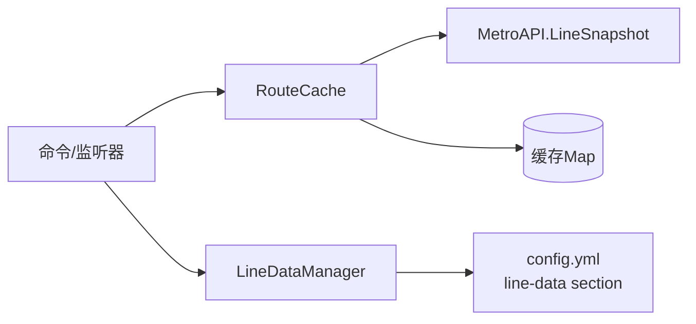
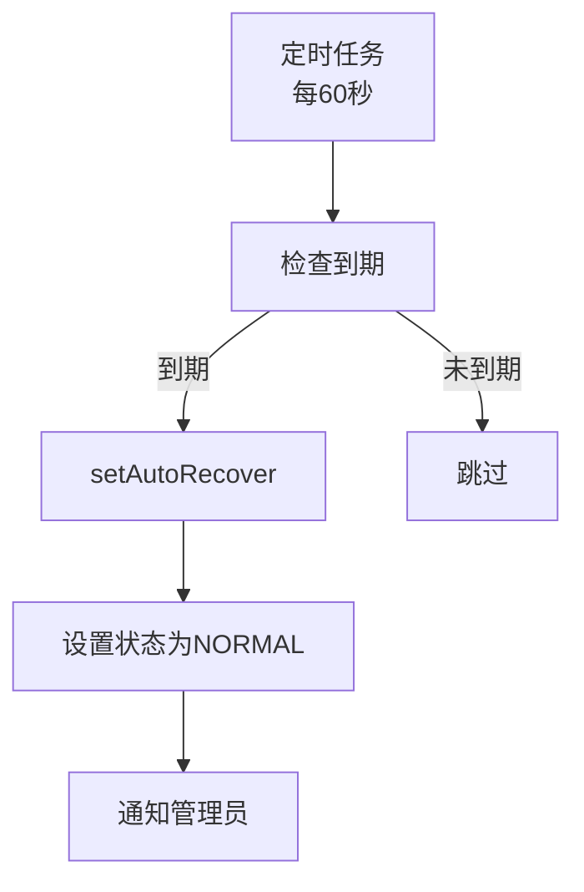
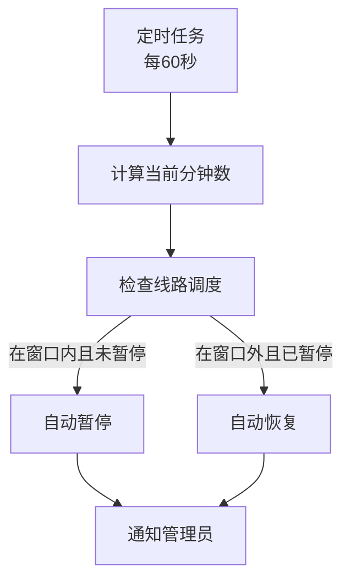

# metro-altroutes 架构文档

## 概述

metro-altroutes 是 Metro 的附属插件，专注于轨道交通运营管理。它通过监听 Metro API、管理线路状态缓存和调度定时任务，为管理员提供精细化的线路运营控制能力。

---

## 高层组件

```
┌──────────────────────────────────────────────────────────┐
│                    MetroAltroutes                         │
│                    (Plugin Bootstrap)                     │
├──────────┬──────────┬──────────┬──────────┬──────────────┤
│ RouteCache│LineData  │ LineCmd  │ Boarding │ Placeholder  │
│ (缓存)   │Manager   │ (命令)   │Listener  │Hook(PAPI)   │
│          │(数据层)  │          │(事件)    │             │
└──────────┴──────────┴──────────┴──────────┴──────────────┘
```

| 组件 | 职责 |
|------|------|
| `MetroAltroutes` | 插件入口，初始化组件、注册命令/监听器、连接 Metro API |
| `RouteCache` | 线路状态缓存，降低 Metro API 调用频率，TTL 30 秒按需刷新 |
| `LineDataManager` | 替代路线优先级、自动恢复、计划调度、运行统计的管理与持久化 |
| `LineCommand` | 命令解析与执行，所有线路管理子命令入口 |
| `BoardingListener` | 拦截玩家乘坐暂停线路，推荐替代路线 |
| `PlaceholderHook` | PlaceholderAPI 扩展，暴露线路数据为占位符 |

---

## 数据流

### 线路状态查询



### 自动恢复调度



### 计划维护时段



---

## 持久化模型

所有数据存储在 `config.yml` 的 `line-data` 节下：

```yaml
line-data:
  alt-routes:
    line1:
      line2: 50    # 替代线路ID: 优先级
      line3: 100
  auto-recover:
    line1: 1716163200000  # 过期时间戳
  schedules:
    line1:
      start: "02:00"
      end: "04:00"
  stats:
    line1:
      suspend-count: 5
      intercept-count: 120
      alt-recommend-count: 35
```

- 启动时从 `config.yml` 加载
- 每次修改后立即保存
- `/m reload` 时重新加载

---

## 调度策略

metro-altroutes 同时支持 Paper/Bukkit 和 Folia：

| 任务 | 调度方式 | 周期 |
|------|----------|------|
| 缓存按需刷新 | `runTaskAsync` (异步) | 触发时 |
| 自动恢复/计划检查 | `BukkitScheduler.runTaskTimer` | 每 60 秒 |
| 缓存初始加载 | `runTaskAsync` (异步) | 启动时一次 |

注意：Folia 下使用 `GlobalRegionScheduler`，Paper 下使用 Bukkit 调度器。

---

## 命令体系

所有命令通过 `LineCommand` 统一处理，使用 Bukkit 原生 `CommandExecutor` 接口。

命令路径：`/m <subcommand> [args...]`

- 子命令通过 `switch` 分发
- Tab completer 提供参数补全
- 权限校验通过 `api.canManageLine()` 和 `metroaltroutes.admin`

---

## 扩展点

| 机制 | 说明 |
|------|------|
| PlaceholderAPI | 注册 `metroaltroutes` 扩展，17 个占位符 |
| MetroAPI | 通过 `MetroAPI.getInstance()` 获取，操作线路状态 |
| 事件监听 | `PlayerInteractEvent` 拦截乘车行为 |
| 管理员通知 | `notifyAdmins()` 向 OP 和 `metroaltroutes.admin` 推送消息 |
